## Data Model Design Overview

This document outlines the comprehensive data model design for our collaboration platform that connects enterprises with academic experts. The system implements a hierarchical user model where all users inherit from a base `profiles` table, enabling role-based access control and specialized functionality. The core entities include `Enterprise` users who can initiate collaboration requests with `Expert` users, while `Admin` users oversee user verification and system management. The `CollaborationRequest` entity manages the workflow between enterprises and experts, supporting approval/rejection states, while `AcademicProduct` entities allow experts to showcase their achievements and research outputs. This design supports a multi-tenant architecture with proper data isolation, authentication, and authorization through Supabase's Row Level Security policies.

### Database Schema Structure

The database uses PostgreSQL with Supabase and implements:
- **Base Profile Table**: `profiles` table that all user types inherit from
- **Role-based Tables**: `members`, `enterprises`, `experts`, `admins` tables that reference the base profile
- **Business Tables**: `collaboration_requests` and `academic_products` for core functionality
- **Enum Types**: `user_role` and `collaboration_status` for type safety
- **Row Level Security**: Comprehensive RLS policies for data access control
- **Triggers**: Automatic profile synchronization with Supabase auth and timestamp updates



```
classDiagram
    class Profile {
        +UUID id
        +String email
        +user_role role
        +DateTime created_at
        +DateTime updated_at
    }

    class Member {
        +UUID id
    }

    class Enterprise {
        +UUID id
        +String company_name
    }

    class Expert {
        +UUID id
        +String expertise_area
    }

    class Admin {
        +UUID id
    }

    class CollaborationRequest {
        +UUID id
        +UUID sender_id
        +UUID receiver_id
        +String details
        +collaboration_status status
        +DateTime created_at
        +DateTime updated_at
    }

    class AcademicProduct {
        +UUID id
        +UUID expert_id
        +JSONB achievements
        +String title
        +String description
        +DateTime created_at
        +DateTime updated_at
    }

    class UserRole {
        <<enumeration>>
        member
        enterprise
        expert
        admin
    }

    class CollaborationStatus {
        <<enumeration>>
        Pending
        Approved
        Rejected
    }

    Profile <|-- Member
    Profile <|-- Enterprise
    Profile <|-- Expert
    Profile <|-- Admin

    Profile --> CollaborationRequest : "sender_id"
    Profile --> CollaborationRequest : "receiver_id"
    Expert --> AcademicProduct : "expert_id"

    Profile --> UserRole : "role"
    CollaborationRequest --> CollaborationStatus : "status"
```

### Table Relationships

1. **Profile Hierarchy**: All user types (`members`, `enterprises`, `experts`, `admins`) inherit from the base `profiles` table via foreign key relationships
2. **Collaboration Requests**: Reference both sender and receiver profiles, supporting bidirectional collaboration
3. **Academic Products**: Owned by experts, allowing them to showcase their work
4. **Authentication Integration**: Profiles table syncs with Supabase `auth.users` table via triggers

### Key Features

- **Type Safety**: Uses PostgreSQL enums for `user_role` and `collaboration_status`
- **Data Integrity**: Foreign key constraints ensure referential integrity
- **Security**: Row Level Security policies control data access based on user identity
- **Audit Trail**: Automatic timestamp tracking with `created_at` and `updated_at` fields
- **Flexible Data**: JSONB fields allow for extensible data structures (e.g., achievements)
- **Validation**: Check constraints ensure data quality (e.g., details length validation)